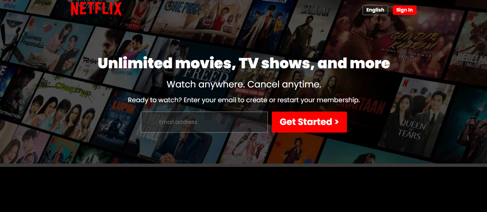

# Netflix UI Clone
## 🚀 Overview
This project is a clone of the Netflix landing page, built using **HTML**, **CSS**, and **JavaScript**. The goal of this project was to recreate the Netflix UI design to enhance my front-end development skills.

 

## 🚀 Screenshots

 

## 🚀 Features
- Clean and minimalistic layout resembling Netflix's UI
- Static content and sections such as the hero section, categories, and footer
- Built with vanilla HTML, CSS, and JavaScript

 

## 🚀 Tech Stack
- **HTML:** To structure the content and layout
- **CSS:** For styling and layout adjustments
- **JavaScript:** For adding functionality

 

## 🚀 Deployment
The app is deployed on <b>Vercel</b> and can be accessed via:
 
https://netflix-ui-replica.vercel.app/

 

## 🚀 Contact
- LinkedIn: www.linkedin.com/in/ibadhussain